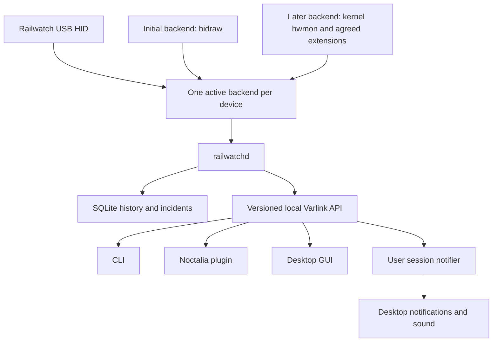

# Railwatch Linux implementation plan

> Implementation status, 2026-09-13: the monitoring stack is implemented and the original development package is installed. The source is now named Railwatch and is public at [Gustav0ar/railwatch](https://github.com/Gustav0ar/railwatch). Protocol decoding, userspace hardware access, shared core and the service client are independent crates; see [architecture](docs/architecture.md). The installed name migration awaits administrator authentication. See [validation](docs/validation.md) for the Ai1600TS hardware runs, resource measurements and actual Noctalia/GUI interaction. Remaining hardware control qualification, releases and kernel work are separate milestones.


Prepared on 2026-09-12 from the archived Windows analysis, Linux prototypes, Windows screenshots, local WireView projects, and current upstream documentation.

Build a Rust daemon and CLI first, a Noctalia Luau plugin and native Rust desktop application next, and propose a separate Rust hwmon driver for upstream Linux. Required kernel bindings and maintainer acceptance remain feasibility gates under the user's Rust-only constraint. Keep the daemon after upstreaming. It continues to own history, software alert rules, desktop event delivery, and configuration policy.

The first supported device should be the MPG Ai1600TS, the model with a recorded hardware verification in the archive. Add other models through explicit protocol profiles and captured evidence. A matching USB ID alone does not establish support.

This document proposes implementation work. This planning pass did not communicate with the PSU, install services, change device settings, or create GitHub repositories.

## What the existing work establishes

The archive contains useful protocol research and prototypes, rather than a finished daemon. The Python implementation provides monitoring and HTTP exports. The C implementation is a snapshot CLI. The Rust implementation provides a snapshot, a monitor loop, controls, and an ordinary directory of hwmon-shaped files. None provides persistent energy history, a durable incident model, or a shared daemon API for desktop clients. See the [archive README](/media/gustavo/APPS/msi-psu-linux/README.md), [Python implementation](/media/gustavo/APPS/msi-psu-linux/src/msi_psu.py), [C implementation](/media/gustavo/APPS/msi-psu-linux/src/msi_psu.c), and [Rust entry point](/media/gustavo/APPS/msi-psu-linux/rust/src/main.rs).

Reuse the command research, screenshots, and verified observations. Keep one maintained userspace implementation. Retain the C and Python programs as research references instead of releasing three competing hardware owners.

Several findings must be resolved before normal hardware control is enabled:

| Finding | Evidence and implementation consequence |
| --- | --- |
| Windows and Linux report offsets need separate validation. | The archive describes 65-byte Windows buffers. Linux hidraw reads omit an artificial report-ID byte for unnumbered reports, while writes require the leading zero. Capture the descriptor and actual Linux report lengths before fixing offsets. [Hidraw documentation](https://docs.kernel.org/hid/hidraw.html) |
| The documented handshake order conflicts with the implementation. | `CONNECT_PSU` sends `00 FA 51`, while one report section says `00 51 FA`. Follow the disassembly as the initial hypothesis and verify it with Linux captures. [Disassembly](/media/gustavo/APPS/msi-psu-linux/references/cPSU_disasm.txt:82) |
| The byte after the echoed command is already payload data. | The existing GET_ALL mapping starts at Windows buffer index 3. It is also tested against the `0xFE` sentinel. Establish busy, error, and valid-data behavior per command, including whether another read or a new read request is required. Do not shift every payload by an invented status byte. [Protocol](/media/gustavo/APPS/msi-psu-linux/docs/PROTOCOL.md), [Get implementation](/media/gustavo/APPS/msi-psu-linux/references/cPSU_disasm.txt:1956) |
| There are distinct P, T, and TS packet layouts. | `GET_ALL` and `GET_ALERTSTATUS` branch by model family. The prototypes apply the TS layout to all five PIDs. [GET_ALL](/media/gustavo/APPS/msi-psu-linux/references/cPSU_disasm.txt:744), [alerts](/media/gustavo/APPS/msi-psu-linux/references/cPSU_disasm.txt:1663) |
| The Ai1600T does not expose the TS command set through this Windows API. | `GET_IOUT_12V2x6`, `GET_OCP12V2x6_CONFIG`, `GET_OCP12V2x6_STATE`, and the buzzer method reject its PID. Do not advertise TS per-pin monitoring for it based on connector count. [Per-pin read](/media/gustavo/APPS/msi-psu-linux/references/cPSU_disasm.txt:249) |
| Command `0xC0` has incompatible meanings across families. | TS uses an eight-byte Safeguard configuration. Older P models use a one-byte multi-rail OCP setting. A generic command writer could misconfigure the device. [Write methods](/media/gustavo/APPS/msi-psu-linux/references/cPSU_disasm.txt:1817) |
| Fan modes are not settled. | The UI stores mode 1 for Performance and mode 3 for Customized. The prototypes call mode 1 manual. Trace the intermediate Windows service mapping and capture the actual device write before choosing hardware values. [UI disassembly](/media/gustavo/APPS/msi-psu-linux/references/UI_disasm.txt:1) |
| The numeric decoder needs an explicit MSI interpretation. | Standard LINEAR11 has a signed mantissa. MSI's `ValueCalc` masks an unsigned 11-bit mantissa. Preserve this difference until raw samples establish whether MSI uses a variant or its application has a decoder defect. Use integer scaling for the kernel. [ValueCalc](/media/gustavo/APPS/msi-psu-linux/references/cPSU_disasm.txt:2211), [Analog Devices format explanation](https://www.analog.com/jp/resources/technical-articles/excel-addin-functions-for-pmbus-number-formats.html) |
| Several claimed hidden capabilities are stronger than the evidence. | A zero-payload buzzer switch does not prove separate sound, mute, and test operations. A status named `OCP_18A` does not prove an immutable shutdown guarantee. The structure of `0xC1` does not establish retention across a power loss. Verify each before promising its behavior. [Research report](/media/gustavo/APPS/msi-psu-linux/docs/msi_psu_decompilation_report.md:225) |
| The prototypes can report invalid data as healthy. | Rust returns its receive buffer after retry exhaustion and maps unknown Safeguard values to Normal. It also references the misspelled variant `MpgAi1300TS`. These are static inspection findings, not results of a build or a Linux hardware test. [Rust transport](/media/gustavo/APPS/msi-psu-linux/rust/src/main.rs:118), [status decoder](/media/gustavo/APPS/msi-psu-linux/rust/src/telemetry.rs:18), [model helpers](/media/gustavo/APPS/msi-psu-linux/rust/src/protocol.rs:40) |

Treat the recorded Ai1600TS measurements as prior Windows verification. Produce a Linux fixture set before declaring Linux support. The screenshot also contains a **View Log** action, so the report's claim that Windows exposes only a generic fault popup needs checking against that workflow. [Main screenshot](/media/gustavo/APPS/msi-psu-linux/docs/screenshots/msi_center_psu_main.png)

### Initial compatibility policy

| Model | PID, vendor `0x0DB0` | Initial scope |
| --- | --- | --- |
| MPG Ai1600TS | `0x808C` | First release target. Validate live Linux telemetry, two groups of six conductor currents, alerts, and controls. |
| MPG Ai1300TS | `0xAA6F` | Candidate for the same family profile. Require its own capture and hardware qualification. |
| MEG Ai1600T | `0xC9EB` | Separate T decoder. Initially restrict support to telemetry confirmed for this model. |
| MEG Ai1300P | `0x56D4` | Separate P decoder, including five 12 V branches where verified. |
| MEG Ai1000P | `0xE749` | Same qualification process as the Ai1300P. |

Each profile declares readable commands, writable operations, layout, units, alarm mapping, and validation status. Unknown revisions retain only operations whose compatibility is established. Missing channels remain unsupported, never fabricated zeroes.

## Repositories and component ownership

Use three repositories, with the CLI beside the daemon. Stage kernel patches in the core repository initially, then develop the submission series against the relevant Linux tree. A fourth permanent repository is unnecessary at this stage.

| Proposed repository | Contents | Release boundary |
| --- | --- | --- |
| `railwatch` | `railwatchd`, `railwatch` CLI, protocol fixtures, typed IPC contract and Rust client crate, history, alert engine, session notifier, systemd and distro packaging, kernel patch staging | One version for the daemon, CLI, notifier, and contract artifacts. |
| `noctalia-railwatch` | Noctalia service, bar widget, panel, settings, persistent transport adapter, demo data | Independently released plugin with a declared daemon API range. |
| `railwatch-gui` | Native desktop app, charts, history explorer, controls, desktop packaging | Independently released application using the published IPC client. |

The existing [WireView daemon architecture](/home/gustavo/Code/personal/tools/wireview-pro-ii/wireviewd/README.md), [Varlink contract](/home/gustavo/Code/personal/tools/wireview-pro-ii/wireviewd/docs/varlink.md), and [Noctalia transport](/home/gustavo/Code/personal/tools/wireview-pro-ii/wireview-pro-ii/README.md) are useful precedents. Reuse their patterns and suitable small components with attribution. Avoid introducing a generic multi-vendor daemon framework before a second implementation actually needs it.

Recommended stack: Rust for the daemon and CLI, SQLite for local storage, Varlink over Unix sockets for IPC, QML for Noctalia, and Rust with Slint for the standalone GUI. Slint follows the [existing WireView desktop decision](/home/gustavo/Code/personal/tools/wireview-pro-ii/wireviewd/docs/adr/0002-slint-rust-desktop.md). Confirm its packaging and licensing requirements when scaffolding the GUI. A web frontend remains an alternative if its charting benefits justify a second UI stack.

Before publishing, select licenses for our implementation and the IPC crate. Use a Linux-compatible SPDX license for kernel contributions. Preserve the provenance of protocol facts and fixtures. Publish our implementation and redacted captures rather than bundling vendor binaries or copying decompiled application code into the driver.

## Keep one owner of hardware communication



This diagram describes alternative backends, not simultaneous polling. All frontends use the daemon API. They never open hidraw or independently write sysfs controls.

The userspace backend serializes requests through one device worker. Allow one outstanding transaction per PSU. Validate response length, echoed command, payload shape, and known sentinel behavior before publishing data. Late replies, exhausted deadlines, disconnects, and unsupported commands produce explicit errors. A failed write can have an unknown outcome. Never automatically repeat a toggle or an EEPROM commit after an ambiguous response.

Start with small modules for transport, device profiles, telemetry, configuration, alerts, history, and IPC. Split protocol and IPC crates where independent reuse warrants it. There is no requirement to make the daemon `no_std` or portable into the kernel.

### Collection and service lifecycle

Proposed starting intervals, subject to measured device latency:

| Data | Schedule |
| --- | --- |
| Composite telemetry `0xE0` and hardware alerts `0xE1` | Every 500 ms, with a 1 s fallback if measurements show the faster schedule is unsuitable. |
| Safeguard state `0xC1` | Every 1 s on validated TS devices, plus an immediate queued read on an observed fault transition. Archive evidence before any user action. |
| Fan setting and duty breakdown | Every 5 s and after a control operation. |
| Runtime counters | Every 30 s. |
| Identity and supported configuration | On attachment, reconnection, or explicit refresh. |

Measure the actual sensor update cadence as well as USB transaction latency. `0x2C` returns fewer values, but a fixed-size USB report does not make it automatically faster. Use it only if measurements justify a different fast path.

Use monotonic deadlines and bounded backoff. Skip missed sampling deadlines instead of building a queue. Cache one telemetry sample for all clients. Keep timestamps and validity for separately polled groups so that a fresh power sample cannot make an old alarm register appear fresh.

Run an always-on system service when monitoring is enabled. Pure client-triggered socket activation would miss pre-login history and alerts. Handle USB hotplug, VM passthrough, suspend, resume, and daemon restarts. Give each attachment a session ID and each sample a sequence number. Identify devices with validated identity plus USB topology fallback, not a persistent `hidrawX` or `hwmonX` number.

Use a dedicated service account and exact device permissions. Replace the archive's world-writable `0666` udev rules. Provide a read-only client socket and a separate control socket restricted to an administrator group. The read-only dispatcher must reject mutations even if the method exists on the control socket. Keep hardware access exclusive to the daemon account. Durable incident acknowledgement uses the control socket. Silencing desktop sound remains a user-session action and does not acknowledge the hardware condition.

Keep databases in the service state directory and sockets in its runtime directory. Restrict service writes to those locations. History queries and slow subscribers must not block sampling. Expose storage failures, stale telemetry, and failed notification delivery as service health, while continuing collection and alert evaluation where possible.

### A stable API for every client

Use a versioned [Varlink interface](https://varlink.org/) following the local WireView precedent. Ship its schema and typed Rust client from the core repository. Noctalia uses Luau and one persistent Rust `railwatch plugin-stream` process. No Python runtime is part of the implementation, and clients do not spawn a fresh process for every reading.

The first contract needs these operation groups:

| Operations | Purpose |
| --- | --- |
| `GetServiceInfo`, `ListDevices`, `GetDeviceInfo` | API compatibility, capabilities, identity, backend, device and storage health. |
| `GetTelemetry`, `SubscribeTelemetry` | Initial sample plus bounded live updates, including timestamps and per-group quality. |
| `ListIncidents`, `GetIncident`, `SubscribeIncidents` | Persistent events, evidence, and a resumable event cursor. |
| `AcknowledgeIncident` | Record an authorized user's acknowledgement without clearing a fault or muting the PSU. |
| `QueryHistory`, `GetEnergySummary`, `ExportHistory` | Bounded queries by device, time range, resolution, and metric. Energy summaries include hourly, daily, weekly, monthly, and yearly consumption and cost. Stream large exports. |
| `GetConfiguration`, `ValidateConfiguration`, `ApplyConfiguration` | Review and apply a complete typed candidate against an expected revision. |
| `StoreDeviceSettings`, `GetOperation` | Explicit persistence and an operation outcome that can be checked after a client disconnect. |

The names are proposed, not an existing API. Add buzzer operations only after their semantics are known. There is no general raw-command or arbitrary sysfs-write method.

Use unit-bearing fields such as `current_ma`, `voltage_mv`, and `power_uw`, with wide accumulators for energy. Preserve raw frames for selected diagnostics. Represent unknown hardware status values explicitly. Distinguish unsupported, invalid, stale, and disconnected data. Version stored samples and incident evidence so decoding improvements do not silently rewrite old observations.

Publish API major versions for breaking changes and feature capabilities for optional additions. Clients should tolerate new fields and reject unsupported mutations. Test the Noctalia and GUI contracts against the daemon simulator before changing a public API.

## Record useful history and honest energy totals

Use one SQLite database per daemon installation with device IDs on every record. A single storage worker writes in batches. WAL permits history reads while collection continues. Retention and rollups run incrementally with bounded work.

Proposed initial retention:

| Record | Retention |
| --- | --- |
| Samples at collection cadence | 48 hours. |
| One-minute aggregates | 90 days. |
| Hourly metric aggregates | 2 years. |
| Hourly energy totals, tariff segments, and coverage | Until the user deletes them. Preserve these compact records when pruning detailed samples, and make any storage-budget limit explicit. |
| Daily energy totals and coverage | Derived from the retained energy records for faster day, week, month, and year queries. |
| Incidents and captured evidence | 1 year by default, with explicit export and deletion controls. |

Estimate disk use from real serialized rows before setting a default byte budget. Keep extrema, time-weighted sums, sample counts, energy increments, and observed duration in aggregates. Otherwise short peaks disappear and averaging averages produces wrong results. Events remain separate from sample retention.

Store UTC timestamps for queries and a monotonic timeline with boot and device-session IDs for integration. Present hour, day, week, month, and year totals in the configured reporting timezone. Use calendar periods, with Monday as the default start of the week. Preserve reporting boundaries when creating energy aggregates, including partial hours and daylight-saving transitions. Distinguish daemon-observed activity from hardware session and lifetime counters.

Integrate only consecutive valid samples in the same continuous observation period:

```text
delta_energy_Wh = ((previous_power_W + current_power_W) / 2) * delta_seconds / 3600
estimated_input_power_W = output_power_W / (efficiency_percent / 100)
estimated_conversion_loss_W = estimated_input_power_W - output_power_W
```

Maintain separate DC output energy and estimated AC input energy. The latter is an estimate derived from the PSU's efficiency reading, unless a future model provides a verified input-power meter. AC voltage alone does not establish input watts. Reject missing, stale, zero, or implausible efficiency values and retain DC energy when AC estimation is unavailable.

Do not interpolate across suspend, restart, disconnect, invalid data, or a gap beyond the configured sampling tolerance. Persist integration checkpoints and sample sequence ownership transactionally to prevent double counting after restart. Mark the unobserved interval explicitly. Lifetime operating hours cannot reconstruct energy consumed while Linux was not observing the PSU, including time in Windows.

Display coverage beside totals, such as "0.82 kWh estimated input, 94% observed". Label peaks as sampled peaks. A 500 ms collector cannot measure millisecond transients. Report period conversion efficiency from corresponding energy totals, rather than averaging instantaneous percentages without weighting.

### Calculate historical cost from the user's electricity price

Consumption and cost history are first-release requirements. Record energy continuously while monitoring is enabled, even before the user supplies an electricity price. The user enters a currency and a price per kilowatt-hour, written as `kWh`. The CLI and GUI must let the user inspect the consumption and cost of any retained hour, day, week, month, or year.

```text
period_cost = sum(estimated_input_energy_kWh_in_tariff_segment * price_per_kWh)
```

Use estimated AC input energy for electricity cost. Keep DC output energy available separately. For example, 0.5 kWh of estimated input energy at R$1.00 per kWh costs an estimated R$0.50. Show the period's energy, cost, currency, applied rate or rates, and observation coverage. Missing prices produce "price not configured", not a zero cost. Missing observations remain gaps in both energy and cost totals.

When the user supplies a price later, let them apply it to previously recorded consumption by choosing its effective date. Store rate changes with effective dates and preserve the energy split at tariff boundaries. A period that spans multiple rates sums the cost of each segment. Do not silently apply a newly entered rate to older periods. An explicit historical correction can recalculate their costs without changing the recorded energy.

Keep energy records independent of prices so later tariff entry and correction do not require the original high-frequency samples. Retain compact hourly energy and tariff segments for historical drill-down after detailed telemetry expires. Accumulate currency calculations with decimal or fixed-point arithmetic and round the displayed total, rather than rounding every sample's cost.

Start with one flat price and its effective-date history. Time-of-use schedules can follow later. Noctalia shows today's estimated energy cost and opens the GUI for the full period breakdown. CSV and JSON exports include the same energy, cost, tariff, and coverage fields.

## Detect imbalance without treating idle noise as a fault

Evaluate each TS connector's six measured 12 V conductors independently. Do not compare the two connectors with each other. Show both absolute spread and deviation from the connector mean:

```text
mean_A = sum(conductor_current_A) / 6
spread_A = max(conductor_current_A) - min(conductor_current_A)
maximum_deviation_percent = 100 * max(abs(current_A - mean_A)) / mean_A
```

The percentage is undefined near zero. Evaluate relative imbalance only when total connector current exceeds the configured minimum load. Require both excessive percentage deviation and an absolute spread above the qualified measurement-noise floor. Keep an absolute per-conductor overcurrent rule independent of that load gate. If one conductor reads near zero while the other five carry substantial load, keep all six in the calculation and flag the possible missing path. Do not discard the low reading and average five conductors.

An unused connector remains quiet. Use "no load observed" unless the hardware supplies a verified connection-presence signal. Validate the relationship between sensor numbering and physical connector orientation before drawing a pin map. Current readings alone cannot establish connector temperature, contact resistance, or that a cable is safe.

Use two sources of incidents:

- Hardware reports from the model-specific alert vector and Safeguard state. Publish a newly observed hardware alarm immediately without adding a software debounce delay.
- Software rules for imbalance, sustained current, temperature, voltage deviation, power, fan behavior, and loss of monitoring. Each rule records the policy revision and the readings that triggered it.

For software imbalance, use the load gate, thresholds, an elapsed trigger duration, lower clear thresholds, and a recovery duration. Other rules use the conditions appropriate to their measurement. Evaluate fresh unrounded values, independently of chart smoothing. Separate warning and critical policies. A gap resets a pending trigger timer. Unknown or stale measurements must not clear an existing incident. Sustained valid low-load readings may mark recovery, with the event recording that the load fell rather than implying that the cable was repaired.

The local WireView implementation exposes a 40% imbalance threshold and a 6 A minimum-load default. Those are useful comparison points, not validated hardware defaults. It also omits imbalance from its default buzzer mask. Define our sound policy explicitly instead of copying that omission. [WireView configuration](/home/gustavo/Code/personal/tools/wireview-pro-ii/wireviewd/docs/usage.md:200), [default alarm actions](/home/gustavo/Code/personal/tools/wireview-pro-ii/wireviewd/crates/wireview-core/src/config.rs:475)

Qualify software thresholds with idle, normal sustained load, load transitions, unused connectors, capture replay, and measurement uncertainty. Do not discover thresholds by deliberately creating a dangerous cable condition. Hardware alarm forwarding can ship before optional software thresholds are qualified.

### Incidents should explain what happened

Give each incident a stable ID with start, last observation, recovery, and acknowledgement times. Store the device, connector, conductor, raw hardware status, severity, source, threshold configuration, and telemetry quality. Acknowledgement changes presentation, not the physical condition.

Keep a 60-second RAM ring before a trigger and collect up to 120 seconds after it. Persist the available window and mark truncation if the device disconnects or power is lost. Capture `0xC1` and `0xE1` on the event path. Record device-provided counters as device time, not an invented exact wall-clock fault timestamp.

Commit the incident and available pre-trigger evidence promptly through the storage worker instead of waiting for the post-trigger window to finish. Set and document the sample flush interval and SQLite durability mode. A sudden power loss can still lose uncommitted data. Recovery should mark incomplete incidents, and a storage failure must not delay the live notification.

Determine whether `0xC1` represents live, latched, or mixed data, and whether reads affect retention. Its documented indexes 3 through 44 describe 42 payload bytes, or 45 bytes including the Windows header. Verify actual report length and behavior. Until then, label its contents "device-reported fault snapshot" instead of promising a permanent black box.

Deduplicate repeated hardware snapshots across reconnects using available device identity, counters, status, and raw evidence, while preserving uncertainty where no unique event identifier exists. Persist active incidents across a daemon restart and reconcile them on the next valid observation. Record acknowledgement, configuration changes, and delivery failures alongside the event.

### Deliver sound and notifications in the user session

Ship a small `railwatch-notify` user service with the core package. It subscribes to incidents and calls the desktop notification service on the session bus. This avoids trying to send desktop notifications from a system daemon. The [Freedesktop specification](https://specifications.freedesktop.org/notification/latest-single/) describes this session-scoped service.

Use this notifier as the single desktop sound owner. Noctalia and the GUI show the same incident and acknowledgement state but do not independently sound alarms. Enforce a single notifier instance per user and deduplicate by incident and escalation level. Route audible output to the active session and retain events for later sessions.

Provide distinct warning and critical sounds, bounded repetition, an explicit desktop sound test, a temporary silence action, and an always-visible active critical state. Respect notification preferences and record delivery failures. Test the actual sound path under Noctalia and PipeWire, including unavailable or muted audio. Software cannot promise an audible warning when no working output exists.

Keep the PSU's autonomous alarm behavior separate. `0xC2` is currently an unresolved switch action. Do not use it as a generic beep command, and do not suppress it merely because a desktop notification was acknowledged. Thermal Grizzly documents its own hardware sound and optional power-button shutdown path, which our software does not automatically reproduce. [WireView Pro II datasheet](https://www.thermal-grizzly.com/media/3a/19/12/1767867542/TG_Datasheet_WV-P-2_EN_TGU20260106.pdf?ts=1770982468)

## Reach Windows feature parity, then improve it

The archived [main view](/media/gustavo/APPS/msi-psu-linux/docs/screenshots/msi_center_psu_main.png) and [real-time dashboard](/media/gustavo/APPS/msi-psu-linux/docs/screenshots/msi_center_psu_realtime_dashboard.png) establish live power, efficiency, temperature, rail readings, conductor currents, recent graphs, energy totals, activity, and CSV export. The vendor also advertises zero-fan and customized cooling settings. [Vendor product page](https://www.msi.com/Power-Supply/MPG-Ai1600TS-PCIE5)

| Workflow | Linux plan |
| --- | --- |
| See current PSU health | Live power, temperature, fan RPM, rail values, connector currents, alarm state, and data age. |
| Check a suspect connector | Six-conductor comparison with mean deviation, absolute spread, thresholds, recent history, and correctly oriented numbering. |
| Understand an alarm | Persistent incident timeline with the relevant graph, raw hardware evidence, acknowledgements, and recovery. |
| Review consumption | Hourly, daily, weekly, monthly, and yearly DC energy, estimated wall energy, conversion loss, coverage, and estimated cost using the user's price per kWh. Support tariff entry after consumption has already been recorded. |
| Inspect graphs and export | Select metrics and time range, align cursors, preserve gaps, export CSV and JSON with units and provenance. |
| Set cooling behavior | Verified firmware modes, duty, and zero-fan settings, with requested, calculated, and actual duty shown separately. |
| Inspect device information | Model, serial, revision, hardware runtimes, capabilities, backend, and service health. |
| Inspect hidden controls | Read-only Safeguard thresholds and timers first. Enable qualified writes later. Show VIN and legacy rail controls only on supported profiles. |

The Noctalia bar should prioritize watts and the highest active severity. Its panel should answer the common questions quickly: current state, connector detail, today's energy, and recent incidents. Open the full GUI for long history queries and configuration review.

The standalone GUI should own longer investigations and configuration workflows. It can open directly to a device, incident, or time range selected in Noctalia. Keep alarm evaluation, history, and calculations in the daemon so both clients agree.

Before UI implementation, build several distinct mocks with identical realistic demo states, publish them through the requested `html-communication` workflow, and wait for a design selection. That skill is not present in this session's skill catalog, so locate it or agree on a publishing substitute at the design milestone. This does not block protocol or daemon work.

Carry the standing design constraints into every mock: true black background, white primary text, dense information, minimal copy, no decorative cards or pills, and no continuous pulse, shimmer, blur, or spinner animations. Repaint charts on new data or interaction, bound plotted geometry, and suspend offscreen rendering. Include healthy, critical, stale, disconnected, no-load, storage-failure, and unsupported-model states.

### Expose controls in stages

First expose inspection and verified reversible fan settings. Each mutation validates the whole candidate, checks the expected configuration revision, serializes the device transaction, and reads back relevant settings. Preserve unmodified fields. Report the observed outcome rather than success based only on an echoed write.

Keep temporary device settings, daemon policy stored on disk, and device nonvolatile settings visibly separate. Do not claim that "temporary" necessarily expires at logout or daemon exit. Its actual lifetime depends on the verified device behavior.

Make `0xF1` an explicit persistence operation. Determine which settings it commits, review the complete affected configuration, and avoid automatic saves on startup, polling, or reconnect. Active readback proves the active value, not nonvolatile persistence. Qualify persistence separately through a planned restart or power cycle.

Read Safeguard configuration before allowing writes. Establish units, encoding, allowed ranges, enable semantics, and timer scaling from the missing service/property code and captures. Keep protection disabling, legacy rail switching, and RGB control out of the first release. `SetLED` uses its own framing and requires model validation.

A multi-point host fan curve is a later feature. The recovered fan setter establishes a mode and duty value, not an arbitrary curve upload. Before shipping host-managed cooling, prove the behavior on a crashed daemon, lost USB connection, suspend, and missing sensor. Retain firmware control as the default.

## Upstream the hardware driver while preserving the daemon

The kernel contribution is a small HID-backed hwmon driver, initially written in C. Rust remains a userspace choice. Share protocol documentation and capture-based expected results between implementations instead of assuming userspace Rust can be moved into the kernel unchanged.

The existing [upstream plan](/media/gustavo/APPS/msi-psu-linux/docs/HWMON_KERNEL_UPSTREAM_PLAN.md) correctly identifies hwmon as the target, but its `/run/hwmon` export and proposed vendor attributes are not an upstream ABI. Ordinary files under `/run` do not register a sensor with `lm-sensors`.

The current upstream hwmon directory checked through `gh` contains `corsair-psu.c` and no matching driver. The inspected liquidctl vendor module handles liquid coolers. This is a narrow duplication check, not proof that no external driver work exists. Search pending hwmon patches and additional implementations before starting the driver.

Use the [Corsair PSU driver](https://docs.kernel.org/hwmon/corsair-psu.html) as a HID integration reference. Establish the vendor report format independently. Use a transaction lock, bounded completion waits, echo validation, correct disconnect handling, and a shared telemetry cache. Register channels through `devm_hwmon_device_register_with_info()` and expose capabilities through visibility callbacks. [Kernel hwmon API](https://docs.kernel.org/hwmon/hwmon-kernel-api.html)

The first RFC should cover validated telemetry and the corresponding known hardware limits and alarms. Add writable fan support after its mapping and failure behavior are established. Proposed TS channels are:

| Data | Standard representation |
| --- | --- |
| 12 V, 5 V, and 3.3 V | `in*_input` and labels, millivolts. |
| Rail and conductor currents | `curr*_input` and labels, milliamperes. |
| Total DC output | `power*_input`, microwatts. |
| Internal temperature | `temp*_input`, millidegrees Celsius. |
| Fan speed | `fan*_input`, RPM. |
| Verified controls and alarms | Appropriate `pwm*`, limit, and alarm attributes only where their defined meaning matches the hardware. |

Map the T and P profiles separately. Avoid assigning meanings that the hardware does not implement, such as treating zero-fan as synonymous with `pwm_enable=0`. Derived energy, software imbalance policy, tariffs, and incident history stay in userspace. [Hwmon ABI](https://docs.kernel.org/hwmon/sysfs-interface.html)

### Resolve advanced access before making the kernel backend the default

Standard hwmon alone may not carry efficiency, fault snapshots, runtime counters, persistence operations, or all Safeguard settings. Discuss each required extension with hwmon and HID maintainers early. The subsystem explicitly asks for discussion before adding nonstandard attributes. [Hwmon submission guidance](https://docs.kernel.org/hwmon/submitting-patches.html)

The kernel must serialize every operation that reaches the device. A userspace lock cannot coordinate with kernel reads, and a driver's internal lock does not automatically serialize arbitrary hidraw traffic. Do not run a raw vendor-control client beside the hwmon driver on the assumption that they will coexist safely.

Support two explicit deployment modes during development:

1. The daemon owns hidraw and provides the full set of validated userspace features. The vendor-specific kernel driver is not bound.
2. The kernel owns communication and the daemon consumes hwmon plus any agreed stable extensions. The API reports unavailable advanced capabilities honestly.

Prefer typed, narrowly defined kernel operations for necessary extensions. Decide their ABI with maintainers rather than committing to a private ioctl tunnel. Debugfs can help development but cannot be a required stable GUI interface. [Debugfs documentation](https://docs.kernel.org/filesystems/debugfs.html)

Do not switch an installed system to the kernel backend silently or automatically unbind its driver. Make backend changes an explicit administrator operation. Default adoption requires a capability comparison and an accepted path for any advanced features we promise to retain. If maintainers do not accept an extension, retain the documented userspace mode instead of bypassing kernel ownership.

Also qualify sample consistency: reading multiple sysfs attributes is not an atomic userspace snapshot. Cache complete device frames in the kernel, measure the read window, and determine how the daemon identifies refresh boundaries or rejects excessive skew. Do not silently label independently refreshed conductor readings as one atomic frame.

Stage the patch series with Kconfig, Makefile, driver documentation, and a MAINTAINERS entry. Run `checkpatch --strict`, targeted build variants, static checks, and hardware lifecycle tests. Find current recipients with `scripts/get_maintainer.pl`, submit an RFC, and iterate through the subsystem's patch process. Upstream acceptance and timing remain external dependencies. [Patch submission process](https://docs.kernel.org/process/submitting-patches.html)

## Delivery sequence and acceptance criteria

| Milestone | Deliverable | Evidence required to finish |
| --- | --- | --- |
| 0. Resolve the protocol | An evidence ledger, model profiles, Linux captures, and deterministic replay fixtures. | Every initial read has a verified frame shape and decoder. Fan mapping, busy behavior, alert layout, and unknown values have explicit outcomes. Unverified writes remain unavailable. |
| 1. Ship the daemon and CLI foundation | Rust device worker, simulator, always-on service, identity, telemetry, reconnect handling, versioned API, and packaging. | Concurrent clients cause no extra device polling. Malformed or stale reports cannot become healthy values. Hotplug, restart, VM detach, and suspend recover without lost ownership. |
| 2. Add history and incidents | SQLite retention, energy integration, historical cost by period, tariff configuration, hardware alarm forwarding, qualified software rules, event evidence, and user notifier. | Replay proves correct energy and cost for every supported period, including later tariff entry, rate changes, and data gaps. Incident transitions survive restart, and one alarm produces one desktop notification stream and bounded sound. |
| 3. Select the client design | Several distinct Noctalia and GUI mocks using the agreed capabilities and failure states. | Published mocks and a selected direction before editing real components. |
| 4. Ship the Noctalia plugin | Bar, panel, live connector detail, incidents, compact energy history, and links to deeper views. | Plugin reconnects, respects capabilities, renders stale values explicitly, and shares daemon incident IDs. |
| 5. Ship the standalone GUI | Live charts, historical queries, incident replay, export, device detail, and qualified configuration workflows. | CLI, GUI, and Noctalia report the same values and incident state. Background and hidden views do not continually repaint. |
| 6. Qualify advanced controls | Verified fan modes, persistence, suitable Safeguard settings, and documented buzzer behavior. | Attended readback and lifecycle qualification establish each operation's effects. Ambiguous outcomes do not trigger automatic retries. |
| 7. Deliver the kernel series and backend | Rust hwmon driver proposal and required bindings, daemon hwmon adapter, agreed advanced-access plan, and upstream submissions. | Maintainer agreement on the Rust approach, real `sensors` output, matching validated measurements and alarms, concurrent-reader and lifecycle tests, and no simultaneous raw and kernel owners. |

Start the kernel ABI discussion after milestone 0, while the userspace product develops. The kernel work does not need to wait for GUI completion. Prototype advanced controls before the final configuration mock if their semantics affect that workflow.

For one engineer with regular access to an Ai1600TS, a useful daemon, CLI, history, alerts, and Noctalia first release is roughly 5 to 8 engineering weeks. A polished GUI and advanced controls could take another 3 to 5 weeks. The kernel series could require 2 to 4 engineering weeks plus maintainer review time. These are planning ranges, not commitments. Additional hardware families and unresolved protocol behavior can expand them.

### Focus validation on actual failure modes

Keep parser and policy tests deterministic. Cover truncated and mismatched replies, busy handling, late responses, numeric boundaries, family layouts, unknown faults, disconnected devices, and invalid efficiency. Use the same telemetry fixtures across the daemon, CLI, plugin, and GUI.

For history, test irregular sampling, suspend gaps, wall-clock changes, timezone boundaries, restart recovery, retention, and disk-full behavior. Verify hour, day, week, month, and year cost totals, later tariff entry, effective-date changes, missing and zero-price tariffs, and currency rounding. Confirm that historical hourly costs remain available after raw sample retention expires. For alerting, test idle noise, one unloaded connector, one missing conductor under load, load steps, hysteresis, stale input, restart deduplication, and a notifier that is unavailable.

For controls, test validation, stale revisions, partial failure, lost acknowledgements, active readback, and nonvolatile persistence as separate outcomes. Use a disposable simulator for CI. Reserve hardware writes and planned power cycles for attended qualification on explicitly selected equipment. Reproduce alarm inputs with fixtures rather than creating electrical faults.

For the kernel, check integer conversion parity, bounded waits, partial responses, simultaneous hwmon readers, probe and removal races, and suspend/resume. Verify that a device read failure reaches userspace as an error, never a fresh zero value.

## Improvements worth prioritizing

| Idea | Benefit and boundary | Priority |
| --- | --- | --- |
| Incident replay with before-and-after graphs | Explains which conductor or rail changed first, and preserves context after a crash. Include sampled-data limits and incomplete windows. | First release |
| Energy coverage and conversion-loss tracking | Makes consumption totals trustworthy and shows the difference between delivered DC energy and estimated wall energy. | First release |
| Historical electricity cost | Calculates hour, day, week, month, and year costs from recorded energy and the user's price per kWh, including prices entered later. | First release |
| Monitoring health as a visible state | Distinguishes a healthy PSU from a stopped collector, missing device, full disk, or failed sound delivery. | First release |
| Exportable diagnostic bundles | Packages redacted identity, versions, protocol capabilities, selected frames, and incident data for support and upstream reports. | Early follow-up |
| Connector labels and load-binned trends | Lets the user label a connector and compare its current distribution at similar loads across weeks. Warn on drift only after measurement uncertainty is understood. | Early follow-up |
| GPU power-limit reduction on a critical event | Provides a Linux analogue to the vendor’s Afterburner integration. Require explicit connector-to-GPU mapping, supported power-limit ranges, and an opt-in policy. | After reliable alert delivery |
| Correlate with WireView readings | A later read-only client can align PSU and WireView incident timelines and measurement points. Do not sum overlapping PSU and GPU power or infer cable resistance from unsynchronized readings. | Later |
| Prometheus and Home Assistant integration | Export cached values, energy counters, event totals, and sample age. Keep HTTP disabled by default and read-only when enabled, with explicit bind configuration. | Later |
| Cooling diagnostics | Compare requested duty, actual duty, RPM, load, and temperature. Avoid a fan-stall alarm when verified zero-fan behavior explains zero RPM. | Early follow-up |
| Optional host poweroff policy | An explicitly configured last-resort software action with logged reasons. It cannot replace autonomous PSU protection. | Later |
| RGB controls | Expose only if compatible hardware and a useful use case justify the additional protocol work. | Low |

The vendor documents an Afterburner workflow that reduces the GPU power limit to 75% on a Safeguard alert. Treat this as a parity reference, not a universal Linux setting. A Linux implementation should use an explicitly configured limit and identify the GPU by stable hardware identity. Where supported, NVML provides power-limit control. Keep this optional privileged operation isolated from normal telemetry access. [Vendor integration description](https://us.msi.com/blog/msi-gpu-safeguard-msi-afterburner-protect-your-gpu-by-reducing-power-during-abnormal-current), [NVML device commands](https://docs.nvidia.com/deploy/nvml-api/api/group__nvmlDeviceCommands.html)

Record the previous limit and avoid raising an already lower limit during mitigation. Keep the reduced limit until an explicit recovery action, and do not overwrite a subsequent change made by another tool. A failed mitigation still leaves the incident active and notifies the user. No PSU current measurement automatically identifies the connected GPU.

## First implementation slice

Start with milestone 0 and a read-only Ai1600TS path: normalize real Linux HID frames, decode one complete telemetry sample, forward hardware alerts, and exercise disconnect recovery through a CLI. Establish the simulator and the local API next. That provides a concrete base for history, incident policy, both clients, and the kernel RFC without committing to unverified device controls.
