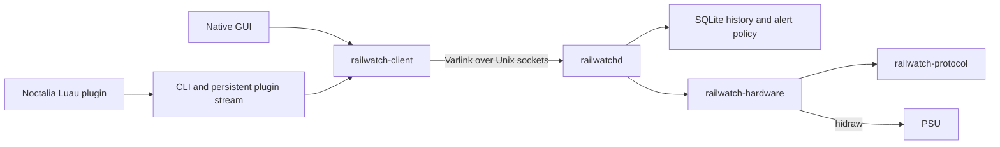

# Architecture

Railwatch separates the device protocol, Linux transport, daemon and client contract into Rust crates. They share one repository so a protocol change can be tested against the daemon and clients in one commit.

| Module | Responsibility | Excludes |
| --- | --- | --- |
| `crates/protocol` | Fixed-size HID framing, integer decoding and TS report validation | `std`, allocation, unsafe code, OS calls, serialization, database and service API |
| `crates/hardware` | Linux hidraw discovery, exclusive ownership, bounded transactions, polling and read-only diagnostics | SQLite, tariffs, incidents, socket server and desktop integration |
| `crates/core` | Userspace telemetry values, pricing validation, calendar boundaries and shared calculations | Hardware access, database and socket server |
| `crates/client` | Versioned Varlink schema, request framing, bounded replies and client calls | Hardware implementation, database and daemon runtime |
| Root `railwatch` crate | Daemon, CLI, service dispatch, storage, incident engine and notifications | Kernel execution |
| `clients/gui` | Native application using `railwatch-client` and `railwatch-core` | Production dependency on the daemon, hardware or database crates |

The hardware crate exposes telemetry and typed diagnostics. Raw command exchange is private to that crate. The service does not construct HID commands or decode USB offsets. The CLI's explicit qualification command uses the hardware crate directly and requires the daemon to be stopped.

The GUI uses the hardware simulator only in its development tests. Its normal dependency tree contains no hardware, protocol or SQLite implementation. `scripts/check-boundaries.sh` verifies that condition, checks the independent client, and requires zero runtime dependencies for the protocol crate. `scripts/check.sh` runs those checks with all workspace tests. Captured Linux reports are tested directly against the protocol crate.

## Future kernel driver

The protocol crate is the part prepared for reuse in a kernel patch. It returns fixed-size readings and typed errors; it does not return userspace telemetry objects, strings or JSON. Its `no_std` build is tested, but compatibility with the kernel's Rust toolchain and APIs has not been established.

The hidraw transport remains a userspace implementation. A kernel driver must implement ownership, transactions, cancellation and caching using kernel HID and hwmon APIs. It cannot import the userspace hardware crate. The protocol source can be incorporated and adapted in a kernel patch rather than requiring Cargo packages at kernel runtime.

Once that driver exists, the daemon can gain an explicit hwmon backend while keeping its client contract and recorded history. No kernel backend is claimed or stubbed today. Standard hwmon attributes should carry supported readings; unsupported advanced capabilities must remain explicit. Do not bind the kernel driver alongside the userspace HID owner. See [kernel handoff](kernel-handoff.md) for qualification and upstream work.
