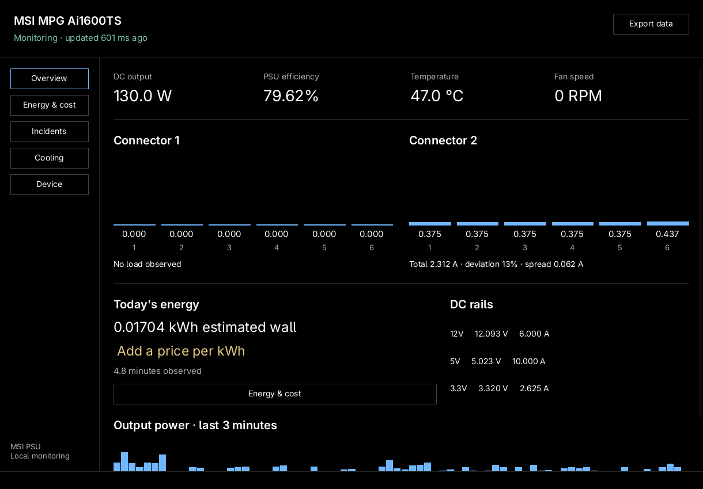
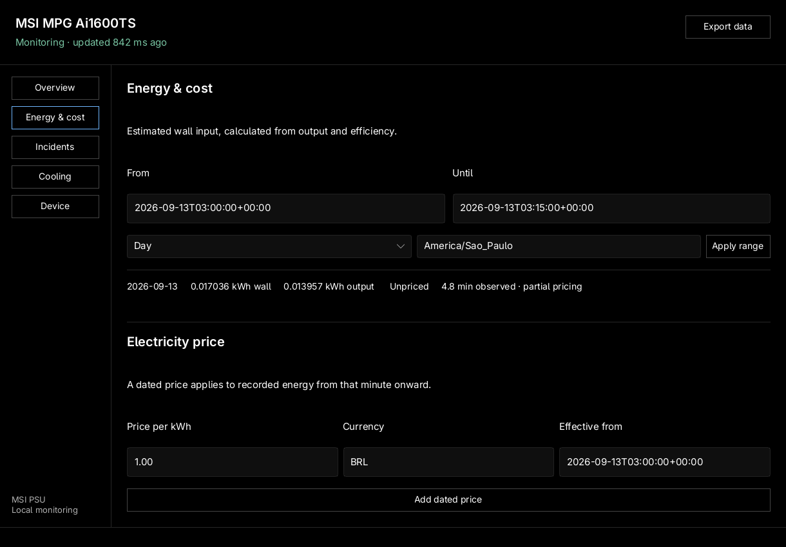
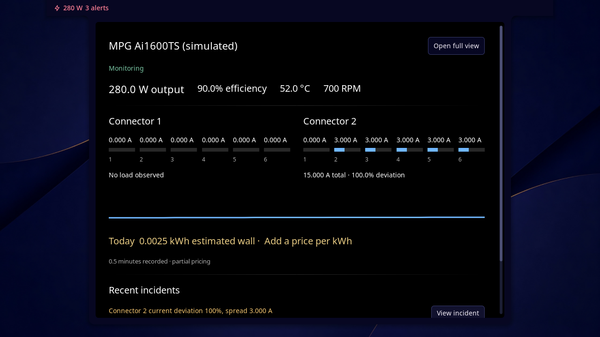
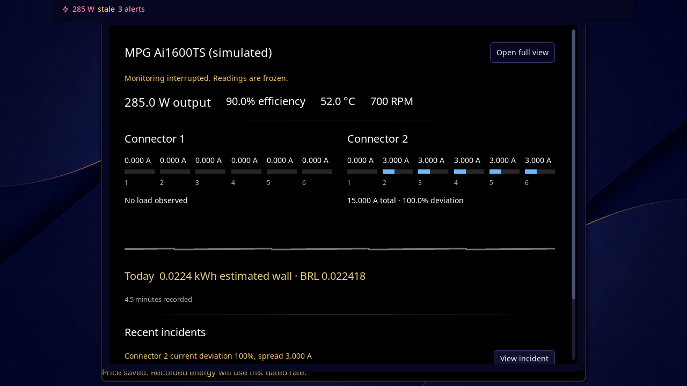
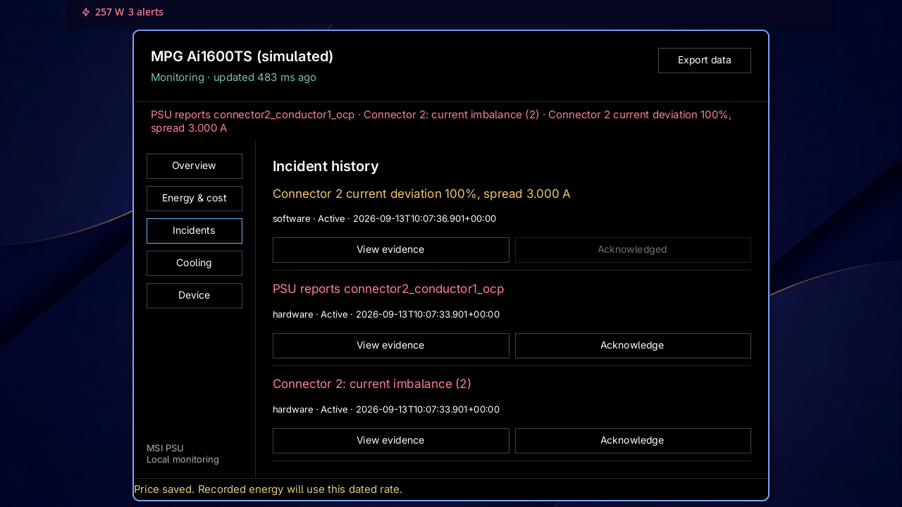

# Validation record

Date: 2026-09-13. Host: CachyOS Linux, MPG Ai1600TS, firmware revision `10`. Live captures and the database stay in ignored `.runtime` files; committed evidence omits the serial number.

## Automated checks

`scripts/check.sh` runs the core Rust tests, Clippy with warnings denied, formatting, native GUI build/tests, Rust transport tests, Noctalia entry behavior tests in an embedded Luau VM and the installed Noctalia offline linter.

Coverage includes:

- Sanitized actual Linux frame decoding and report length/echo validation.
- Runtime counters with low byte `0xFE`, including the live values that exposed the original sentinel bug.
- Integer price precision, delayed tariff entry, mid-hour rate changes, all calendar periods, DST's repeated hour, raw-sample pruning, process restart and incomplete pricing.
- Immediate hardware alarms, delayed software imbalance, no-load behavior and stale readings that cannot clear hardware incidents.
- Actual daemon and CLI subprocesses over Unix sockets, watch streaming, acknowledgement persistence, active-incident identity across restart, policy revision conflicts, read-socket mutation rejection and explicit disconnect state.
- A real SQLite write lock held until the bounded queue overflowed. Telemetry, software/hardware alerts and read-only history queries continued; recording and incident evidence recovered after the lock was released.
- Calendar boundaries across 23-hour and 25-hour days, midnight clock changes and a skipped date. Clients use the system time zone unless explicitly overridden.
- A blocked GUI consumer cannot accumulate more than eight pending updates. Closing the receiver releases its worker; a full action queue displays an error. Hung notification/audio processes have a five-second deadline and are terminated and reaped.
- Native software-rendered navigation clicks and form callbacks for energy queries, dated prices and acknowledgement. Rendered stale/storage-error states retain the last reading and show the problem.
- Noctalia panel, widget and service behavior with real entry scripts in the Luau VM and a documented-host API test double. The persistent Rust plugin stream is exercised against the simulator daemon.

## Live hardware run

The first four-minute capture retained 241 samples and all energy coverage. Two runtime groups were incorrectly rejected because their ordinary binary counter values had low byte `FE`. Power and energy remained available. The decoder now distinguishes that byte from an otherwise empty error-pattern reply.

The repeat capture ran for 270 seconds:

| Observation | Result |
| --- | --- |
| Samples retained | 270 |
| Time between first and last samples | 268,961 ms |
| Missing reading groups | 0 |
| Previously problematic counter values | Both decoded successfully |
| DC output range | 126–352 W |
| Temperature range | 48–50 °C |
| Fan range | 396–420 RPM |
| DC energy | 0.013207576 kWh |
| Estimated wall energy | 0.016096337 kWh |
| Valid energy coverage | 268,961 ms |
| SQLite integrity check | `ok` |

See [machine-readable evidence](live-validation.json). The existing live database was subsequently reused for client preview, with a new integration session; the recorded values above describe only the completed repeat run.

A subsequent optimized-build hardware run retained 66 readings across 64,946 ms, with zero missing reading groups, output of 218–382 W, and SQLite integrity `ok`. See [release-build hardware evidence](release-live-validation.json).

The CLI, Noctalia's persistent transport and native GUI renderer read the same daemon. Multiple clients did not open HID. Firmware changed fan speed while raw mode remained 1 and requested duty remained zero. No PSU control or nonvolatile write was sent.

## Desktop and packaging

The optimized Rust `plugin-stream` process was profiled against a simulator with active incidents: 20 seconds of warm-up, 300 seconds of measurement, and a separate 20-second stalled-reader check. It used 5,840–5,888 KiB RSS and 0.070% of one CPU core. The simulator daemon used 8,544–9,412 KiB RSS and 0.140% of one core. Open descriptors stayed at four for the stream and twelve for the daemon. A stalled reader used 5,764 KiB, and closing the pipe ended the stream within five seconds. A separate integration test restarted the daemon and verified that the same stream process reconnected. See [resource measurements](performance.json).

These observations do not prove zero leaks over indefinite operation. The checks enforce explicit memory-growth, descriptor and CPU budgets. Run `cargo test --release --test performance -- --ignored --nocapture` for the endurance check; `MSI_PSU_SOAK_SECONDS` can extend its measured window up to 86,400 seconds. Application transport and tests use Rust; Noctalia entries and their host fixture use Luau. No Python runtime is required.

A labeled desktop notification and one-second warning tone were sent through `notify-send` and `pw-play`. Both processes completed successfully. This proves delivery to the notification/audio stack, not independently measured speaker audibility. The check used an isolated user-state directory and did not install a notifier service.

Systemd's offline verifier accepted copies of the service definitions with executable paths pointing to the development binaries. The installed `/usr/bin` paths do not exist yet. Group creation, udev application, installed service startup, session group access and package installation have not been exercised on the daily-driver system.

The Arch package was built locally with `makepkg`, including its daemon/CLI integration and native GUI checks. The recipe includes all three binaries and the Noctalia source. CachyOS's default GCC LTO produced incompatible bundled SQLite objects on the first build; the package-specific `!lto` setting fixed the link. A source archive SHA-256 was verified before the successful build. No package installation was performed. The local package retains a build-path reference in the GUI; it is a development artifact rather than a reproducible public release.

## Rendered native UI

These images come from the actual Slint components connected to the daemon, not the earlier HTML mocks:

The selected design is A, connector focus. Both clients also ran together in the installed Noctalia v5.1.0 on a private headless Umbriel display. The test used separate XDG/configuration directories, a private D-Bus session, a simulator database and software rendering. The daily-driver shell configuration was not modified.

Actual pointer input opened the plugin's full-view button, which launched the release Rust GUI. Native navigation, scrolling, dated-price submission and acknowledgement were exercised. CLI queries confirmed the saved BRL 1.00/kWh rate and incident acknowledgement in the daemon database. Stopping the simulator froze values with an explicit stale state in both clients; restarting it restored monitoring and retained the acknowledgement.

## Remaining qualification

No dangerous cable faults were induced. Hardware alarm cases use deterministic simulated/captured protocol states. Physical cable orientation, threshold calibration under sustained workloads, suspend/resume, USB detach/reconnect, daemon-crash firmware cooling behavior, physical power cycles and models other than this Ai1600TS remain unverified.

Cooling writes, safeguard mutation, buzzer switching, persistence and the kernel driver remain staged work, as described in the plan. GitHub repositories, release publishing, system installation and kernel submission have not occurred. This is a tested local monitoring implementation, not a claim that the complete upstream roadmap is finished.
